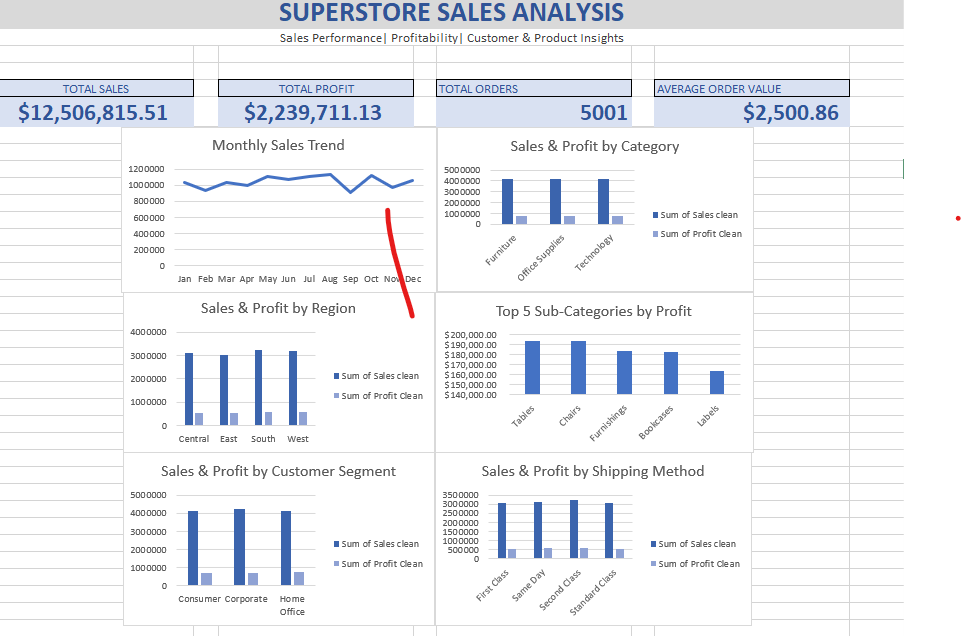

# Superstore Excel Sales Analysis

## Project Overview

This project analyzes Superstore retail sales data using Microsoft Excel. The analysis evaluates overall sales performance, profitability, product performance, regional trends, customer segments, shipping methods, and monthly sales trends.

An interactive Excel dashboard was created using PivotTables, PivotCharts, calculated metrics, and data-cleaning techniques to turn raw transaction data into business-focused insights.

## Tools & Skills

- Microsoft Excel
- Excel Tables
- PivotTables
- PivotCharts
- Data Cleaning
- KPI Development
- Trend Analysis
- Profitability Analysis
- Dashboard Design
- Business Insights

## Key Performance Indicators

| Metric | Value |
|---|---:|
| Total Sales | $12.51M |
| Total Profit | $2.24M |
| Total Orders | 5,001 |
| Profit Margin | 17.9% |
| Average Order Value | $2,500.86 |

## Dashboard

## Analysis Areas

- Monthly Sales Trends
- Sales & Profit by Category
- Sales & Profit by Region
- Top 5 Sub-Categories by Profit
- Sales & Profit by Customer Segment
- Sales & Profit by Shipping Method

## Key Insights

- The business generated approximately $12.5M in sales and $2.24M in profit.
- The analysis identified the strongest-performing product sub-categories based on profit.
- Regional analysis highlighted differences in sales and profitability across geographic markets.
- Customer segment analysis identified the strongest revenue-generating customer groups.
- Shipping analysis showed differences in performance across shipping methods.
- Monthly analysis revealed changes in sales performance throughout the year.

## Project Outcome

This project demonstrates the ability to transform raw transactional data into a structured Excel analysis and business dashboard. The dashboard provides a clear view of sales performance and profitability while highlighting areas that can support business decision-making.

